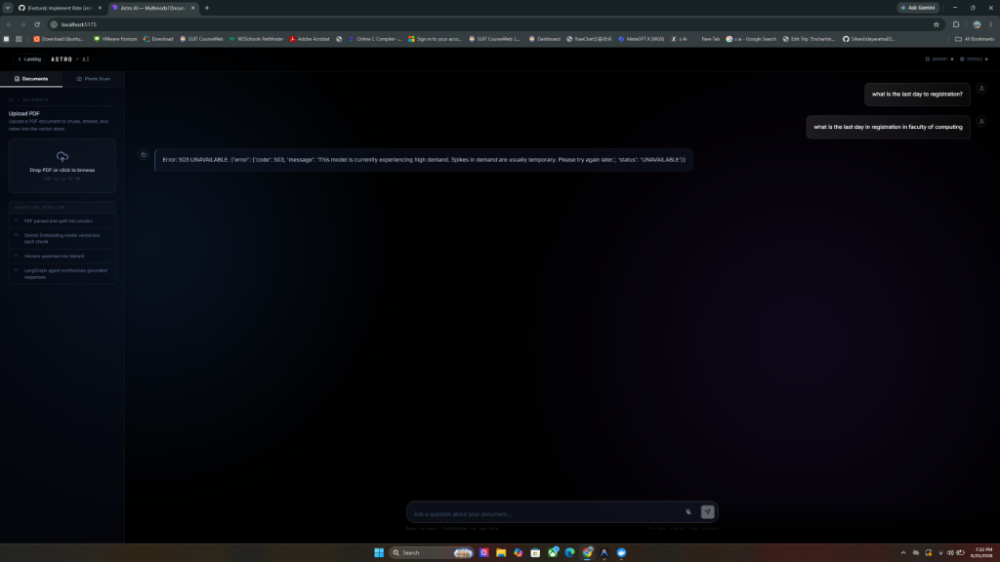
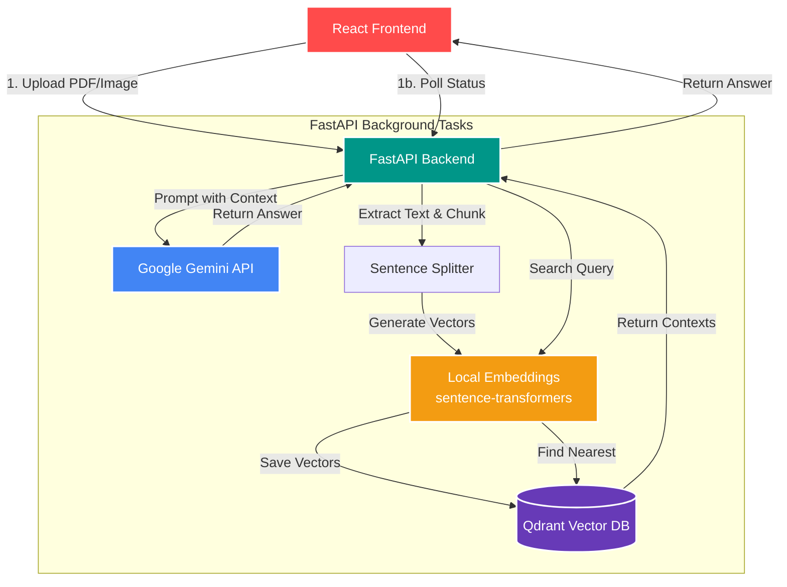

# AI RAG Assistant



A robust Retrieval-Augmented Generation (RAG) assistant built with **React**, **FastAPI**, **sentence-transformers**, **Qdrant**, and the **Google Gemini API**. It processes PDF documents and images, stores local embeddings in a vector database, and uses an LLM to answer questions strictly based on the provided context.

## 🏗️ Architecture

The system uses Python's asynchronous background tasks for reliable processing, keeping embeddings local to avoid API quotas.



## 🚀 How to Run Locally

You will need to open **three separate terminals** to run all the microservices required for this project.

### 1. Start Qdrant (Vector Database)
Qdrant stores the document embeddings for fast semantic search.
```bash
docker run -p 6333:6333 qdrant/qdrant
```

### 2. Start the FastAPI Backend
This serves the API endpoints and processes background ingestion jobs.
```bash
uv run uvicorn app.main:app --reload --port 8000
```

### 3. Start the React Frontend
This serves the user interface.
```bash
cd frontend
npm run dev
```

---

## 🎯 Usage

1. Navigate to **http://localhost:5173** in your browser.
2. Expand the sidebar to **upload a PDF or Image**. Wait for the green success message.
3. In the main chat area, **ask a question** about the document you just uploaded.
4. The system will retrieve the most relevant chunks and generate an answer using Gemini.

## 🛠️ Features
- **Local Embeddings:** Uses `sentence-transformers` (`all-MiniLM-L6-v2`) locally to completely bypass API embedding quota limits and protect your data.
- **Persistent Job State:** Background ingestion tasks survive server reloads using a file-backed job store.
- **Robust Model Fallbacks:** Automatically falls back across multiple Gemini models (`gemini-1.5-flash`, `gemini-1.5-pro`, etc.) to gracefully handle API rate limits (429) and permissions issues (403).
- **Local Vector DB:** Uses Qdrant locally to ensure your data stays on your machine until sent to the LLM.
- **Multimodal Support:** Supports both PDFs and Images (via Gemini Vision OCR).
