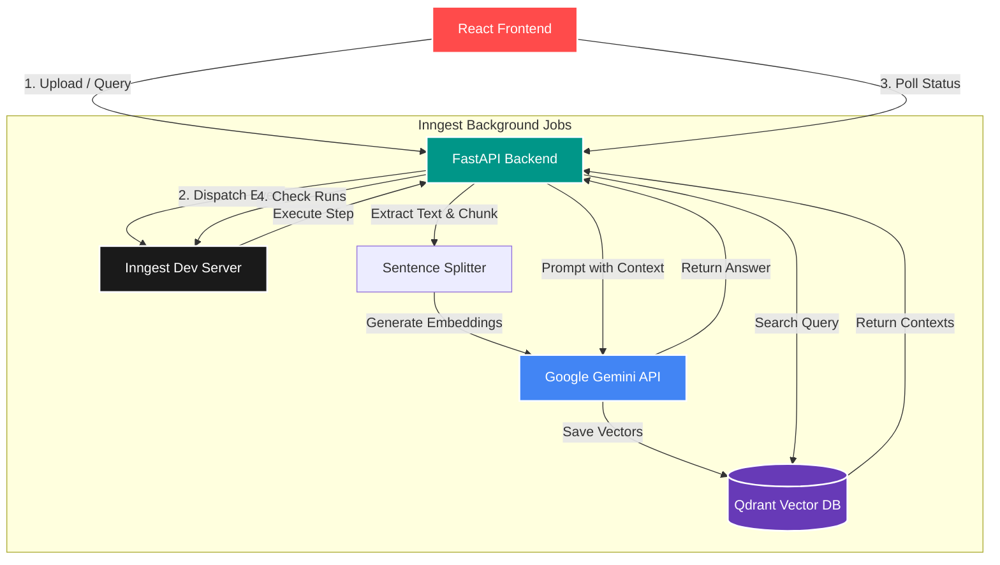

# AI RAG Assistant

A robust Retrieval-Augmented Generation (RAG) assistant built with **React**, **FastAPI**, **Inngest**, **Qdrant**, and the **Google Gemini API**. It processes PDF documents, stores their embeddings in a vector database, and uses an LLM to answer questions strictly based on the provided context.

## 🏗️ Architecture

The system uses an event-driven architecture powered by Inngest to ensure reliable, retriable background processing for both document ingestion and LLM querying.



## 🚀 How to Run Locally

You will need to open **four separate terminals** to run all the microservices required for this project.

### 1. Start Qdrant (Vector Database)
Qdrant stores the document embeddings for fast semantic search.
```bash
docker run -p 6333:6333 qdrant/qdrant
```

### 2. Start the FastAPI Backend
This serves the API endpoints that Inngest uses to execute background jobs.
```bash
uv run uvicorn main:app --reload --port 8000
```

### 3. Start the Inngest Dev Server
Inngest acts as the orchestrator to manage and retry background jobs reliably.
```bash
npx inngest-cli@latest dev -u http://localhost:8000/api/inngest
```

### 4. Start the React Frontend
This serves the new user interface.
```bash
cd frontend
npm run dev
```

---

## 🎯 Usage

1. Navigate to **http://localhost:5173** in your browser.
2. Expand the sidebar to **upload a PDF**. Wait for the green success message.
3. In the main chat area, **ask a question** about the PDF you just uploaded.
4. The system will retrieve the most relevant chunks and generate an answer using Gemini.

## 🛠️ Features
- **Event-driven reliability:** All heavy lifting (chunking, embedding, LLM calls) happens asynchronously via Inngest.
- **Model Fallbacks:** Automatically falls back across multiple Gemini models (`gemini-2.5-flash-lite`, `gemini-2.5-flash`, etc.) to gracefully handle rate limits and quota exhaustion.
- **Local Vector DB:** Uses Qdrant locally to ensure your data stays on your machine until sent to the LLM.
