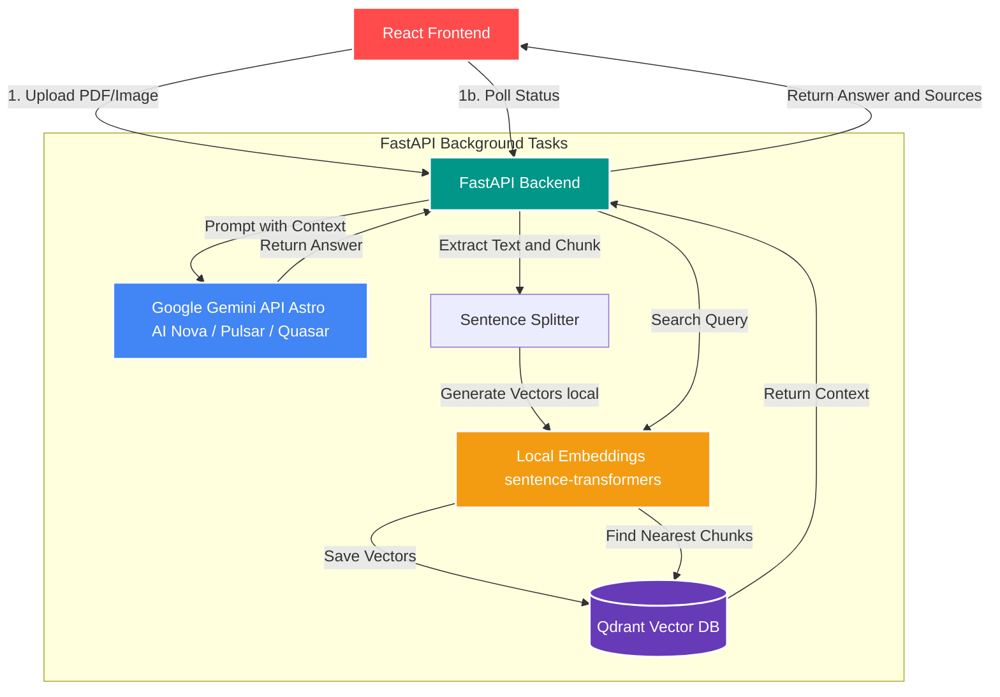
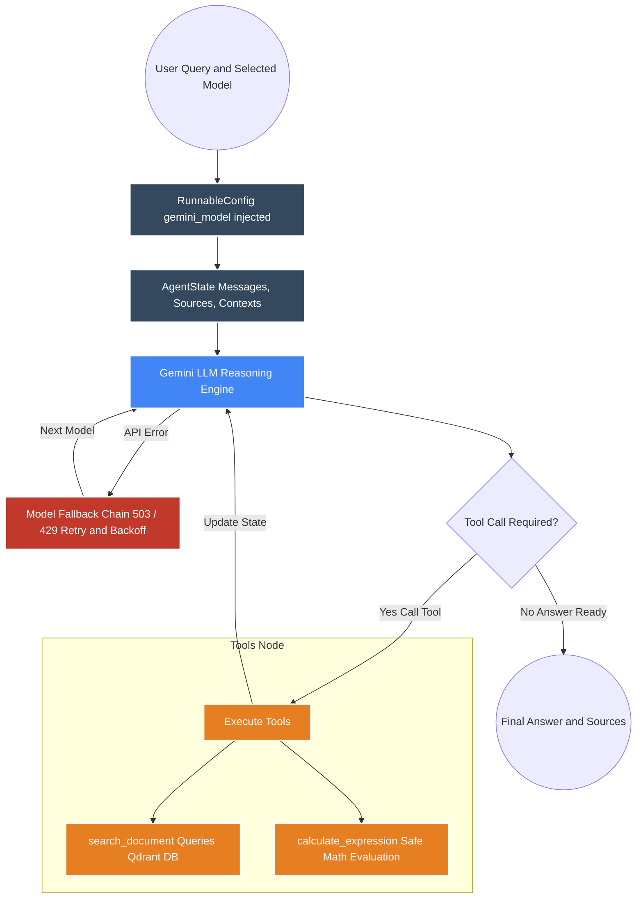
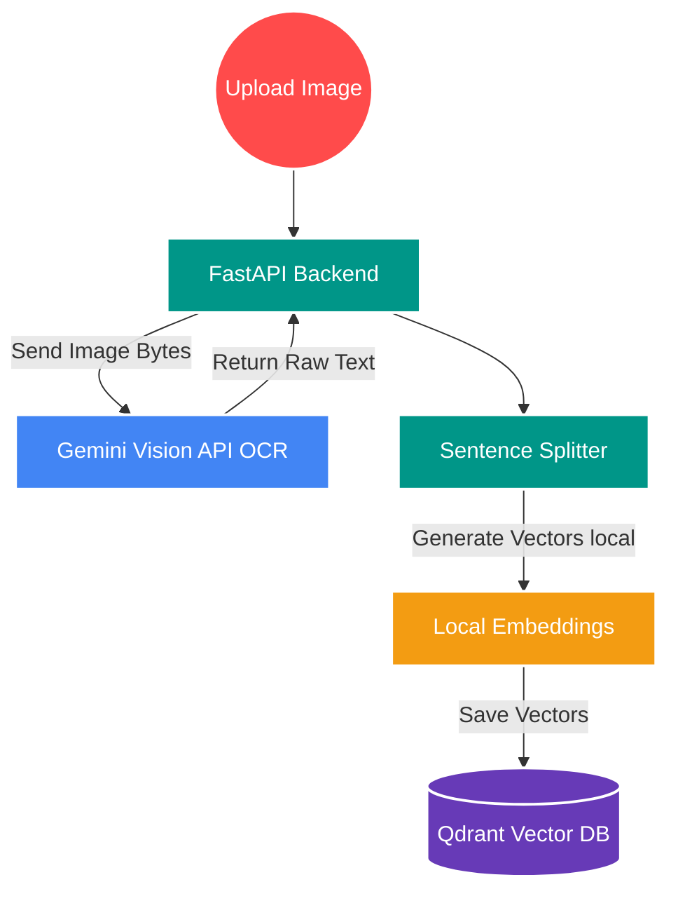

# Astro AI


**Astro AI** is an intelligent document assistant built with **React**, **FastAPI**, **LangGraph**, **sentence-transformers**, **Qdrant**, and the **Google Gemini API**. Upload a PDF or image, and instantly ask questions about it using natural language. Astro AI retrieves the most relevant context from your documents and generates precise, source-grounded answers — all without sending your raw documents to an external server.

---

## Architecture

The system uses Python's asynchronous background tasks for reliable processing, keeping embeddings fully local to avoid API quota costs.



---

## Agentic RAG Workflow (LangGraph)

When a user asks a question, Astro AI delegates to a **LangGraph Agent** — a cyclic reasoning loop that decides whether to search the database, calculate, or synthesize a final answer. The model used for each request is dynamically injected via **LangGraph RunnableConfig**, making the full model tier system completely stateless and scalable.



**How the Agent Works:**

1. **Model Selection** — The user picks an Astro AI model tier in the UI. The frontend sends the model ID (`nova`, `pulsar`, `quasar`) with every query.
2. **Model Routing** — `main.py` resolves the Astro model ID to the underlying Gemini model name and injects it into LangGraph via `RunnableConfig`.
3. **Initialize State** — The agent initializes a state object tracking all messages, sources, and context counts.
4. **Reasoning Loop** — The selected Gemini LLM decides whether to call a tool. If it calls `search_document`, the tool embeds the query locally, searches Qdrant, and returns relevant paragraphs and source filenames.
5. **Self-Healing Fallback** — If the primary model returns a `503 Unavailable` or `429 Rate Limit` error, the system automatically retries with the next model using exponential backoff — invisibly to the user.
6. **Synthesis** — The LLM synthesizes the final grounded answer and returns it with cited sources.

---

## Astro AI Model Tiers

Astro AI uses a named model tier system. Each tier maps to an underlying Gemini model.

| Astro AI Model      | Underlying Model   | Status        | Description                                  |
|---------------------|--------------------|---------------|----------------------------------------------|
| **Astro AI Nova**   | `gemini-1.5-flash` | Available     | Fast and lightweight. Ideal for quick lookups. |
| **Astro AI Pulsar** | `gemini-2.0-flash` | Coming Soon   | Balanced. Recommended for most tasks.        |
| **Astro AI Quasar** | `gemini-1.5-pro`   | Coming Soon   | Most powerful. Deep reasoning and analysis.  |

> To add a new model tier, add one entry to `ASTRO_MODEL_MAP` in `app/main.py` and one entry to `ASTRO_MODELS` in `frontend/src/App.tsx`.

---

## OCR Workflow (Image Processing)

When a user uploads an image instead of a PDF, Astro AI uses Gemini Vision for OCR before passing extracted text into the standard embedding pipeline.



---

## How to Run Locally

Open **three separate terminals** to run all required services.

### 1. Start Qdrant (Vector Database)

```bash
docker run -p 6333:6333 qdrant/qdrant
```

### 2. Start the FastAPI Backend

```bash
uv run uvicorn app.main:app --reload --port 8000
```

### 3. Start the React Frontend

```bash
cd frontend
npm run dev
```

Navigate to **http://localhost:5173** in your browser.

---

## Usage

1. Go to **http://localhost:5173** and click **Get Started**.
2. In the sidebar, upload a **PDF or image**. Wait for the green success indicator.
3. In the chat area, type any question about your document and press Send.
4. Astro AI retrieves the most relevant chunks and generates a grounded answer with source citations.

---

## Features

| Feature | Description |
|---|---|
| **Astro AI Model Tiers** | Named model variants (Nova, Pulsar, Quasar) mapping to specific Gemini models with an in-chat model selector. |
| **Agentic RAG (LangGraph)** | A cyclic LangGraph agent that decides when to search, calculate, or answer — not a naive search-then-summarize pipeline. |
| **Local Embeddings** | Uses `sentence-transformers` (`all-MiniLM-L6-v2`) locally — zero API calls for embedding, zero quota usage. |
| **Local Vector DB** | Qdrant runs locally; document data stays on your machine until only the most relevant paragraphs are sent to the LLM. |
| **Multi-Model Fallback** | Automatically retries across Gemini models with exponential backoff on 503 and 429 errors. |
| **Multimodal OCR** | Supports PDFs and images (PNG, JPG, WEBP) via Gemini Vision OCR of text, tables, and charts. |
| **Multi-Conversation History** | Full conversation management with independent chats, history panel, and auto-titling. |
| **Persistent Job State** | Background ingestion tasks survive server reloads via a file-backed jobs store. |
| **Power-User Slash Commands** | `/map` Mind Map view, `/split` side-by-side PDF viewer, `/zen` distraction-free mode, `/export` Markdown export. |
| **Voice Input** | Browser-native speech recognition for hands-free question entry. |
