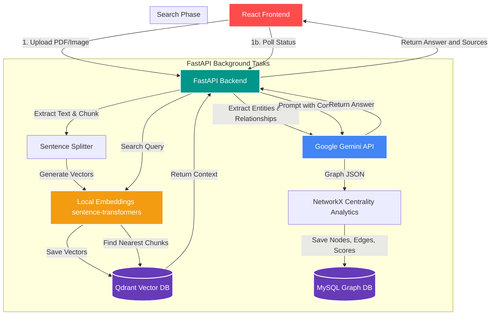
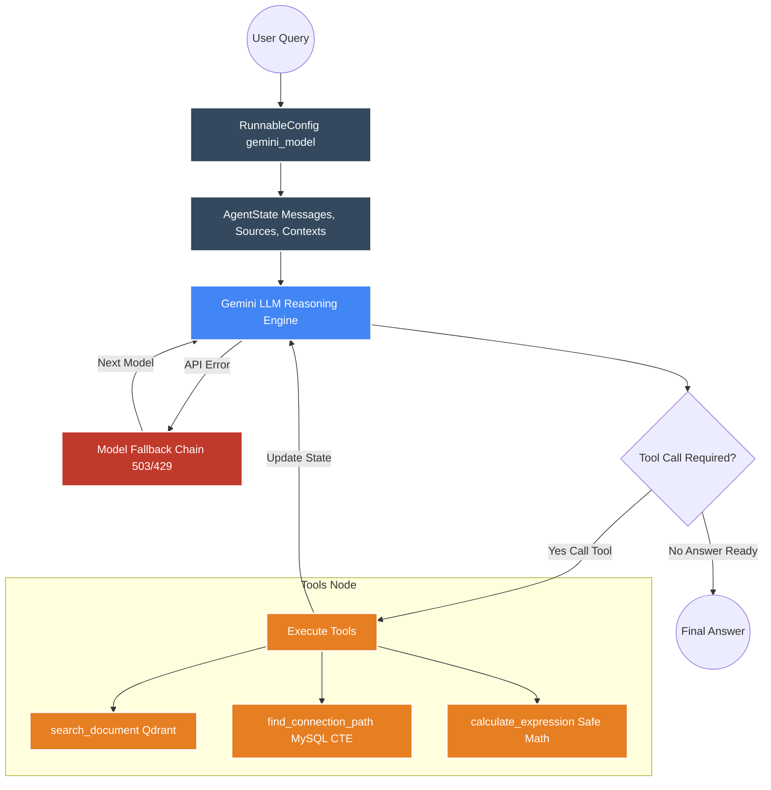

# Astro AI


**Astro AI** is an intelligent document assistant built with **React**, **FastAPI**, **LangGraph**, **sentence-transformers**, **Qdrant**, **MySQL**, and the **Google Gemini API**. Upload a PDF or image, and instantly ask questions about it using natural language. Astro AI retrieves the most relevant context from your documents and generates precise, source-grounded answers. 

Beyond standard RAG, Astro AI automatically extracts a **Multi-Hop Knowledge Graph** from your documents, computes PageRank centrality, and empowers the AI to deductively trace hidden connections between concepts using advanced Recursive SQL queries.

---

## Architecture

The system uses Python's asynchronous background tasks for reliable processing. Embeddings are kept fully local to avoid API quota costs, while complex entity extraction relies on Gemini.



---

## Agentic RAG Workflow (LangGraph)

When a user asks a question, Astro AI delegates to a **LangGraph Agent** — a cyclic reasoning loop that decides whether to search the vector database, query the relational knowledge graph, calculate math, or synthesize a final answer. 



**How the Agent Works:**
1. **Model Selection** — The user picks an Astro AI model tier in the UI.
2. **Initialize State** — The agent tracks messages, sources, and context counts.
3. **Reasoning Loop** — The Gemini LLM decides which tool to call:
   - `search_document`: Embeds the query locally and searches Qdrant for textual context.
   - `find_connection_path`: Executes a `WITH RECURSIVE` SQL CTE query in MySQL to trace connections between two concepts up to 4 hops deep.
4. **Self-Healing Fallback** — The system automatically retries with the next model on `503` and `429` errors.
5. **Synthesis** — The LLM synthesizes the final grounded answer and returns it with cited sources.

---

## Astro AI Model Tiers

Astro AI uses a named model tier system. Each tier maps to an underlying Gemini model.

| Astro AI Model      | Underlying Model   | Status        | Description                                  |
|---------------------|--------------------|---------------|----------------------------------------------|
| **Astro AI Nova**   | `gemini-1.5-flash` | Available     | Fast and lightweight. Ideal for quick lookups. |
| **Astro AI Pulsar** | `gemini-2.0-flash` | Available     | Balanced. Recommended for most tasks.        |
| **Astro AI Quasar** | `gemini-1.5-pro`   | Available     | Most powerful. Deep reasoning and analysis.  |

---

## Advanced Features: Multi-Hop Knowledge Graph

Astro AI doesn't just read your text; it maps the relationships inside it.

1. **Entity Extraction**: During ingestion, Gemini extracts core entities (People, Organizations, Concepts) and their relationships.
2. **PageRank Centrality Analytics**: Using `networkx`, the backend computes a PageRank centrality score for every node to determine its global importance within the document.
3. **Visual Split-View**: The frontend renders this graph dynamically using `react-force-graph-2d`. Highly central nodes are physically larger, allowing you to instantly spot the most important concepts.
4. **Ghost Drag UX**: You can drag nodes directly off the canvas and drop them into the persistent chat bar! Dropping two nodes automatically constructs a Multi-Hop query for the LangGraph agent.

---

## How to Run Locally

Open **separate terminals** to run all required services.

### 1. Start Databases
Ensure you have MySQL running on `localhost:3306` with a database named `astro_ai` and root password `root`.
Start Qdrant (Vector Database):
```bash
docker run -p 6333:6333 qdrant/qdrant
```

### 2. Start the FastAPI Backend
```bash
uv run uvicorn app.main:app --reload --port 8000
```

### 3. Start the React Frontend
```bash
cd frontend
npm run dev
```

Navigate to **http://localhost:5173** in your browser.

---

## Features Matrix

| Feature | Description |
|---|---|
| **Multi-Hop Knowledge Graph** | Extracts a relational graph of your document into MySQL, accessible visually and via AI tools. |
| **Graph Centrality Analytics** | Calculates PageRank to physically scale node sizes based on their document-wide importance. |
| **Interactive Ghost Drag UX** | Drag and drop visual graph nodes directly into the chat box to trigger advanced AI queries. |
| **Agentic RAG (LangGraph)** | A cyclic LangGraph agent that decides when to search, trace connections, or answer. |
| **Recursive CTE Engine** | AI utilizes advanced MySQL `WITH RECURSIVE` queries to deductively find paths between nodes. |
| **Local Embeddings** | Uses `sentence-transformers` locally — zero API calls for embedding, zero quota usage. |
| **Multi-Model Fallback** | Automatically retries across Gemini models with exponential backoff on 503/429 errors. |
| **Multimodal OCR** | Supports PDFs and images via Gemini Vision OCR of text, tables, and charts. |
| **Split-Screen Layout** | View the interactive Knowledge Graph side-by-side with your real-time chat history. |
| **Voice Input** | Browser-native speech recognition for hands-free question entry. |
